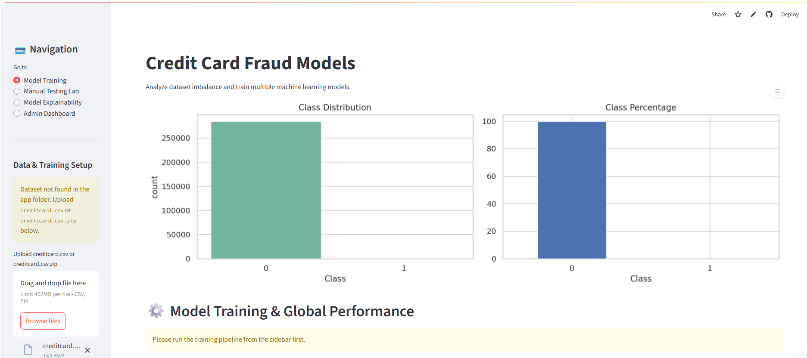
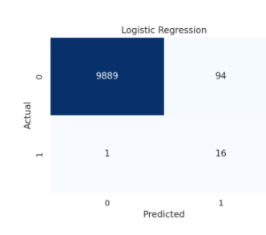
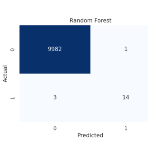
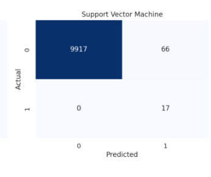
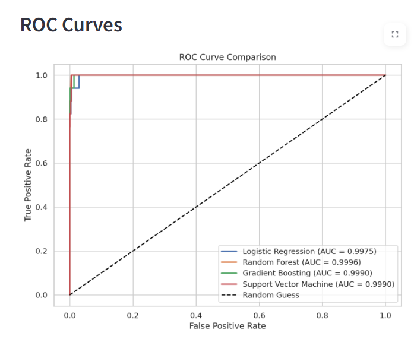
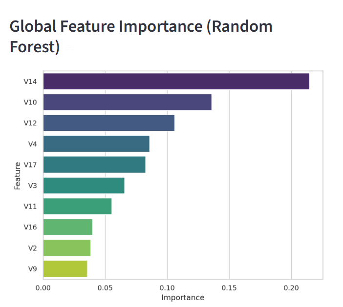
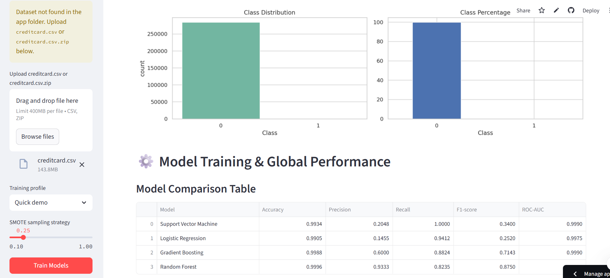
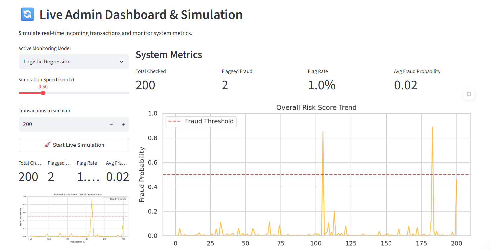
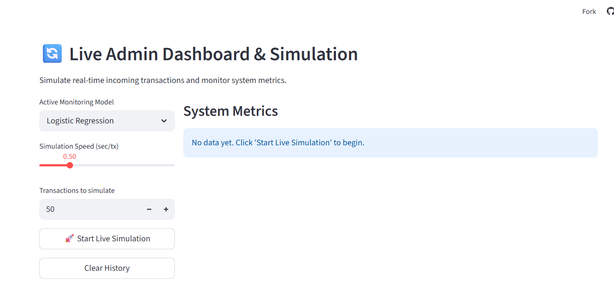

# 💳 Credit Card Fraud Detection using Machine Learning

## 📖 About the Project

Credit Card Fraud Detection is a critical application of Machine Learning in the financial industry. With millions of transactions occurring daily, detecting fraudulent transactions quickly and accurately is essential to minimize financial losses.

This project presents a complete end-to-end fraud detection system that leverages Machine Learning algorithms to identify fraudulent credit card transactions. The system addresses the highly imbalanced nature of fraud datasets using SMOTE oversampling and provides real-time monitoring through an interactive Streamlit dashboard.

---

## 🎯 Project Objectives

- Detect fraudulent credit card transactions accurately.
- Handle severe class imbalance using SMOTE.
- Compare multiple Machine Learning models.
- Analyze model performance using various evaluation metrics.
- Visualize fraud patterns and model predictions.
- Provide explainable AI insights through feature importance analysis.
- Deploy a user-friendly web application for fraud monitoring.

---

## 🚀 Key Features

✅ Credit Card Fraud Detection

✅ SMOTE-Based Data Balancing

✅ Multiple Machine Learning Models

✅ Logistic Regression

✅ Random Forest Classifier

✅ Gradient Boosting Classifier

✅ Support Vector Machine (SVM)

✅ ROC Curve Analysis

✅ Confusion Matrix Comparison

✅ Feature Importance Visualization

✅ Real-Time Fraud Monitoring

✅ Interactive Streamlit Dashboard

✅ Cloud Deployment

---

## 📊 Dataset Information

The project uses the Credit Card Fraud Detection Dataset containing anonymized transaction records.

| Metric | Value |
|----------|----------|
| Total Transactions | 284,807 |
| Fraud Transactions | 492 |
| Legitimate Transactions | 284,315 |
| Fraud Percentage | 0.172% |
| Features | Time, Amount, V1-V28 |
| Target Variable | Class |

---

# 🏗️ Project Workflow

### 1️⃣ Data Collection

- Credit Card Transaction Dataset

### 2️⃣ Data Preprocessing

- Data Cleaning
- Missing Value Validation
- Feature Scaling
- Data Transformation

### 3️⃣ Class Balancing

- SMOTE Oversampling Technique

### 4️⃣ Model Training

The following Machine Learning models were implemented:

- Logistic Regression
- Random Forest
- Gradient Boosting
- Support Vector Machine (SVM)

### 5️⃣ Model Evaluation

Evaluation Metrics:

- Accuracy
- Precision
- Recall
- F1 Score
- ROC-AUC Score
- Confusion Matrix

### 6️⃣ Explainability

- Feature Importance Analysis
- Fraud Risk Scoring
- Model Explainability

### 7️⃣ Deployment

- Streamlit
- GitHub
- Streamlit Community Cloud

---

# 📸 Project Screenshots

## Dataset Distribution Analysis

### Class Distribution



The dataset is highly imbalanced, highlighting the need for advanced fraud detection techniques and oversampling methods.

---

# 🤖 Machine Learning Models

## Logistic Regression

A strong baseline classification model with excellent fraud detection performance.

### Confusion Matrix



Results:

- True Negatives: 9889
- False Positives: 94
- False Negatives: 1
- True Positives: 16

---

## Random Forest Classifier 🏆

Random Forest achieved the highest overall performance among all implemented models.

### Confusion Matrix



Results:

- True Negatives: 9982
- False Positives: 1
- False Negatives: 3
- True Positives: 14

### Why Random Forest?

- Highest Accuracy
- Lowest False Positive Rate
- Strong Precision
- Excellent Explainability

---

## Gradient Boosting Classifier

Gradient Boosting achieved strong fraud detection capability with a balanced trade-off between precision and recall.

### Confusion Matrix


Results:

- True Negatives: 9973
- False Positives: 10
- False Negatives: 2
- True Positives: 15

---

## Support Vector Machine (SVM)

Support Vector Machine achieved perfect recall by successfully identifying all fraudulent transactions.

### Confusion Matrix



Results:

- True Negatives: 9917
- False Positives: 66
- False Negatives: 0
- True Positives: 17

---

# 📈 ROC Curve Comparison



The ROC curve comparison demonstrates excellent model performance.

| Model | ROC-AUC Score |
|---------|---------|
| Logistic Regression | 0.9975 |
| Random Forest | 0.9996 |
| Gradient Boosting | 0.9990 |
| Support Vector Machine | 0.9990 |

---

# 🔍 Feature Importance Analysis

## Global Feature Importance (Random Forest)



Top Fraud Indicators:

1. V14
2. V10
3. V12
4. V4
5. V17

These features contribute most significantly to fraud prediction decisions.

---

# 🌐 Interactive Streamlit Dashboard

The project includes a fully interactive Streamlit application for fraud detection, model comparison, explainability, and real-time monitoring.

---

## Dataset Upload Interface



Users can upload:

- creditcard.csv
- creditcard.csv.zip

The application automatically validates and processes uploaded datasets.

---

## Live Admin Dashboard



Dashboard Features:

- Active Monitoring Model Selection
- Fraud Risk Trend Visualization
- Real-Time Metrics
- Fraud Detection Statistics
- Dynamic Charts

---

## Fraud Monitoring Simulation



The simulator evaluates incoming transactions and continuously tracks fraud probabilities.

Features:

- Risk Trend Monitoring
- Fraud Threshold Alerts
- Live Statistics
- Transaction-Level Analysis

---

# 📊 Model Performance Summary

| Model | False Positives | False Negatives |
|---------|---------|---------|
| Logistic Regression | 94 | 1 |
| Random Forest | 1 | 3 |
| Gradient Boosting | 10 | 2 |
| SVM | 66 | 0 |

### Best Overall Model

🏆 **Random Forest Classifier**

Reasons:

- Lowest False Positive Rate
- Excellent Precision
- Strong Accuracy
- Robust Performance

---

# 🛠️ Technology Stack

### Programming Language

- Python

### Data Processing

- Pandas
- NumPy

### Machine Learning

- Scikit-Learn
- Imbalanced-Learn (SMOTE)

### Visualization

- Matplotlib
- Seaborn
- Plotly

### Web Application

- Streamlit

### Deployment

- GitHub
- Streamlit Cloud

---

# 📂 Project Structure

```text
Credit-Card-Fraud-Detection/
│
├── app.py
├── requirements.txt
├── runtime.txt
├── README.md
├── CREDIT_CARD_FRAUD_DETECTION.ipynb
│
├── images/
│   ├── class_distribution.png
│   ├── logistic_regression_cm.png
│   ├── random_forest_cm.png
│   ├── gradient_boosting_cm.png
│   ├── svm_cm.png
│   ├── roc_curve.png
│   ├── feature_importance.png
│   ├── dashboard_upload.png
│   ├── live_dashboard.png
│   └── simulation_dashboard.png
```

---

# ⚙️ Installation

### Clone Repository

```bash
git clone https://github.com/samson1106/Credit-Card-Fraud-Detection.git
cd Credit-Card-Fraud-Detection
```

### Install Dependencies

```bash
pip install -r requirements.txt
```

### Run Streamlit Application

```bash
streamlit run app.py
```

---

### Samson Barla

B.Tech Mathematics & Computing

Netaji Subhas University of Technology (NSUT)
